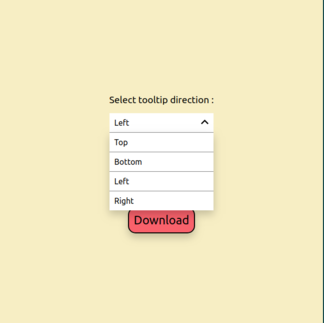

### Hosted at : https://baishalid.github.io/react-tooltip/

## Functionality

This is a simple app created using React. Hover over the Download button to display a tooltip. You can change the position at which the tooltip appears by selecting the desired position from the dropdown menu. The available options for position are:
    1. top
    2. bottom
    3. right
    4. left

## Run this project locally

To run this project in your local system:
1. Clone this repository
2. Navigate to the project directory in your terminal using `cd tooltip`
3. Run the following commands in the terminal:
    npm install
    npm start

